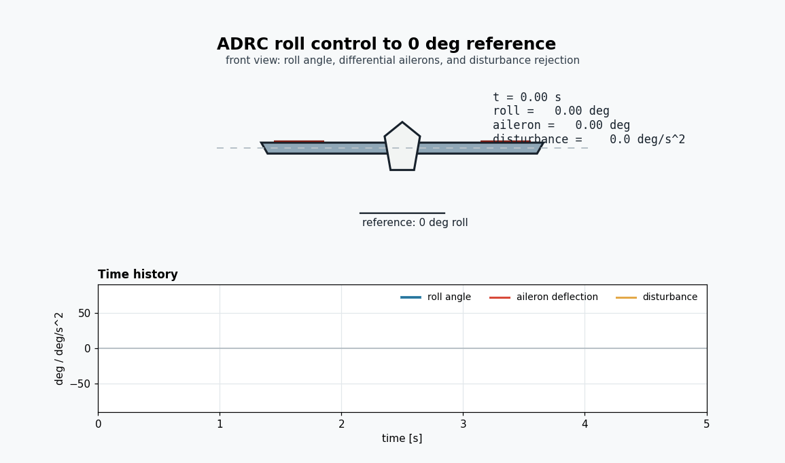

# ADRC Roll Control Visualization

This project creates a simple GIF animation of a roll-axis Active Disturbance
Rejection Control (ADRC) example.



The reference command is `0 deg` roll angle. The simulation injects two roll
disturbance pulses, and the controller drives the aircraft back toward level
flight. The animation shows:

- a front view of the aircraft wing,
- differential aileron/control-surface deflection,
- the current roll angle,
- the disturbance torque indicator,
- time histories for roll angle, aileron deflection, and disturbance.

## Files

- `adrc_roll.py` - Python simulation and Matplotlib animation script.
- `requirements.txt` - Python package requirements.

## Install

```bash
python3 -m pip install -r requirements.txt
```

## Run

```bash
python3 adrc_roll.py
```


## Model

The example uses a deliberately small roll-axis plant:

```text
phi_ddot = b0 * delta_a + disturbance - damping * phi_dot
```

The controller is a linear ADRC-style controller with an extended state
observer. The observer estimates roll angle, roll rate, and the lumped
disturbance, then compensates the disturbance when computing aileron command.
